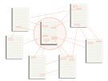
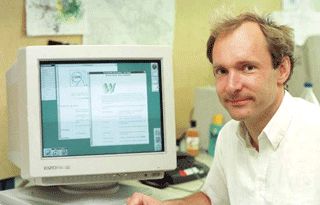
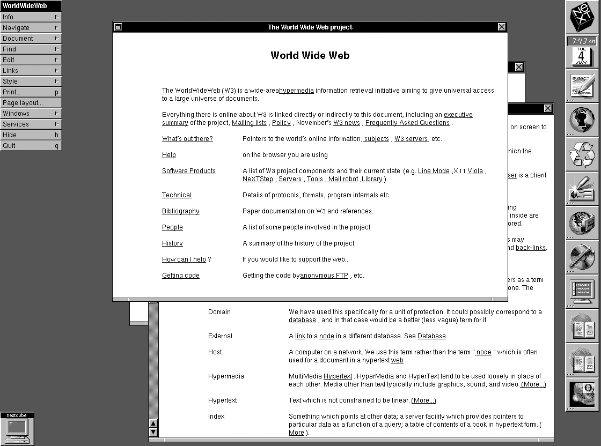
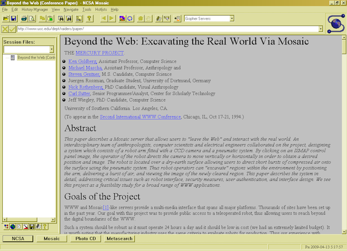
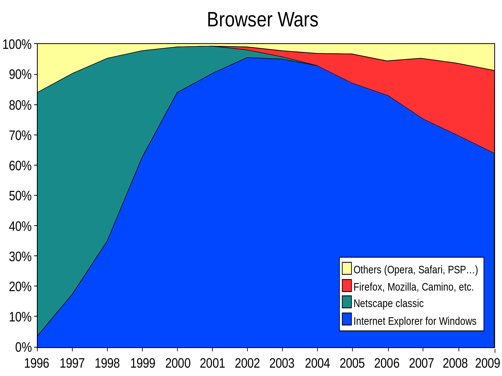
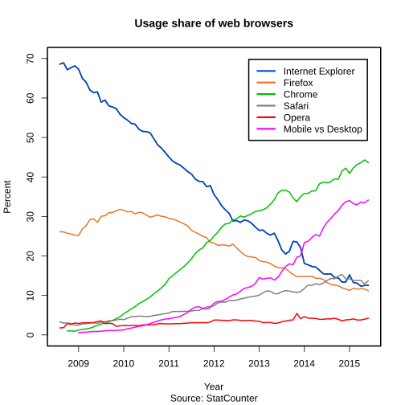
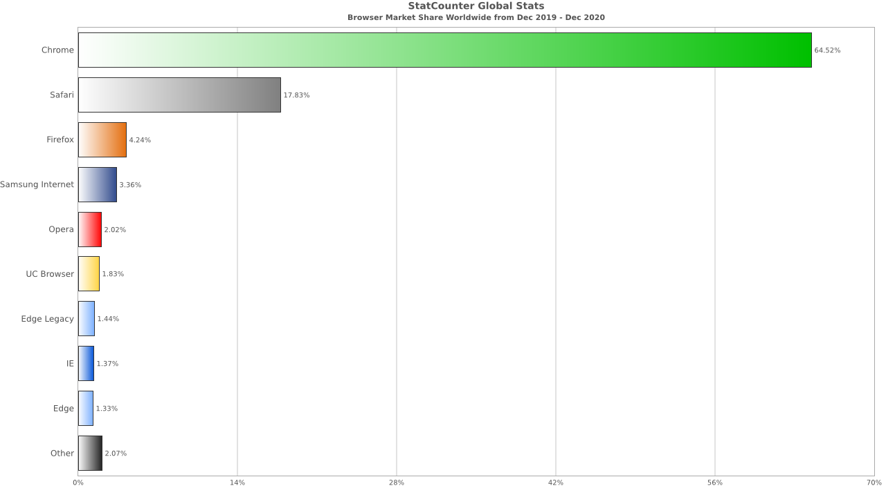
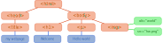
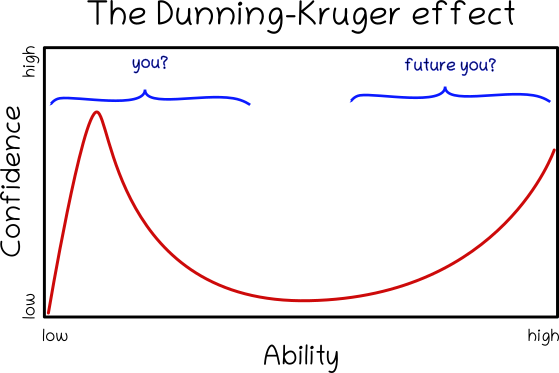

# CTEC3905
## Front-end web development

<div class="flex-center intro">
	
	
	
</div>

### Introduction

<p class="flex-center">
	Dr Graeme Stuart
</p>

-----

## Hypertext

Ted Nelson coined the term **Hypertext** in the 1965.

<figure>
	
	<figcaption>Ted Nelson</figcaption>
	<blockquote cite="https://dl.acm.org/doi/10.1145/800197.806036">
		"THE KINDS OF FILE structures required if we are to use the computer for personal files and as an adjunct to creativity are wholly different in character from those customary in business and scientific data processing. They need to provide the capacity for intricate and idiosyncratic arrangements, total modifiability, undecided alternatives, and thorough internal documentation."
		<strong> — Ted Nelson, "A file structure for the complex, the changing and the indeterminate", August 1965</strong>
	</blockquote>
</figure>

-----

## HyperText

Hypertext is non-linear.
The links are part of the content.

<figure>
	
	<figcaption>Hypertext documents include embedded links to other hypertext documents</figcaption>
</figure>

<blockquote>
	"(...)'Hypertext' is a recent coinage. 'Hyper-' is used in the mathematical sense of extension and generality (as in 'hyperspace,' 'hypercube') rather than the medical sense of 'excessive' ('hyperactivity'). There is no implication about size— a hypertext could contain only 500 words or so. 'Hyper-' refers to structure and not size."
	<strong> — Ted Nelson, "Brief Words on the Hypertext", 23 January 1967</strong>
</blockquote>

-----

## The world-wide web

The **world wide web (www)** was created in 1989 by **Tim Berners-Lee**.

<figure>
	
	<figcaption>Tim Berners-Lee</figcaption>
</figure>

The world-wide web is an open system for publishing **HyperText documents** linked in a web of information served from around the world over the internet.
Other hypertext systems were available but the **open nature** of the world wide web meant that it was able to grow exponentially.

-----

## The first website(?)

<iframe src="http://info.cern.ch/hypertext/WWW/TheProject.html" height="100%"></iframe>
Visit it [here](http://info.cern.ch/hypertext/WWW/TheProject.html).

-----

## The first browser

[Nexus](http://digital-archaeology.org/the-nexus-browser/), created by Tim Berners-Lee was originally named **WorldWideWeb** but the name was changed to avoid confusion.

<figure>
	
	<figcaption>The Nexus browser - "An exercise in global information availability"</figcaption>
</figure>

The browser provided authoring and editing functionality.
See a demo [here](https://www.youtube.com/watch?v=3c3Rt6QbHDw&feature=youtu.be).

-----
## The modern history - in brief

In the beginning... were the browser wars.
A *Cambrian explosion* of browsers fought for market share.
In 1994, the **Mosaic browser** was released and was an instant success.
Eventually Mozaic was renamed to **Netscape Navigator** - *codename: Mozilla*.

<figure>
	
	<figcaption>The Mosaic browser</figcaption>
	<blockquote>
		"There are two ages of the Internet—before Mosaic, and after. The combination of Tim Berners-Lee's Web protocols, which provided connectivity, and Marc Andreesen's browser, which provided a great interface, proved explosive. In twenty-four months, the Web has gone from being unknown to absolutely ubiquitous." — Mark Pesce, ZDNet
	</blockquote>
</figure>

-----

## Web standards and open source

The World Wide Web Consortium, founded in October 1994, develop web standards.
Open standards and open source browsers are core to the modern web.

<figure>
	
	<figcaption>The World Wide Web Consortium</figcaption>
</figure>

<blockquote cite=https://www.w3.org/standards/>
	W3C standards define an Open Web Platform for application development that has the unprecedented potential to enable developers to build rich interactive experiences, powered by vast data stores, that are available on any device. - W3C
</blockquote>


-----

## The first browser war - divergence

<div class="small"></div>

Computing giant **Microsoft** creates <strong>Internet Explorer</strong> and makes it available for free in 1995.
**Netscape Navigator** struggled to remain viable (only free for home and educational use).

<figure>
	
	<figcaption>The first browser war and the beginning of the second</figcaption>
</figure>

Many versions of each browser were released including new proprietary (i.e. non-standard) features including **scripting** and **style sheets**. In 2000, **IE 5.0** was the first browser to fully support **CCS1** but had a flawed *box-model* which did not match the standard.

-----

## The second browser war - convergence

The Mozilla foundation created the open-source phoenix browser which became firebird and then **firefox**.
Instead of touting proprietary extensions, browsers were marketed based on standards compliance.

<figure>
	
	<figcaption><strong>Firefox</strong> is open-sourced, Google release <strong>Chrome</strong> and mobile browsers are on the rise</figcaption>
</figure>

**Google Chrome** includes faster *javascript* and an open-source version **Chromium**.
The current Microsoft Edge browser is now based on the Chromium code.

-----

## Current standards

The current standards, *HTML5*, *CSS3* and *JavaScript ES6* will be used throughout this module.
Be careful, you may find content on the web which uses older standards.

<div class="flex j-center intro">

<figure>
	
	<figcaption>
		HTML version 5
	</figcaption>
</figure>

<figure>
	
	<figcaption>
		CSS version 3
	</figcaption>
</figure>

<figure>
	
	<figcaption>Javascript ES6</figcaption>
</figure>

</div>

For more insight into how web standards work see [this interview](https://upload.wikimedia.org/wikipedia/commons/transcoded/2/22/CSS_Standardization_-_The_State_of_the_Web.webm/CSS_Standardization_-_The_State_of_the_Web.webm.480p.vp9.webm) with Jen Simmons of Mozilla.


-----

# CTEC3905
## Front-end web development

<div class="flex-center intro">
	
	
	
</div>

### Practicalities

-----

## Learning outcomes

<div class="large"></div>

1.	Use **GIT and GitHub** for version control and code storage
2.	Demonstrate critical understanding of **Information Architecture, user interface design, usability principles and semantic markup**
3.	Demonstrate detailed understanding of all three current **front-end web technologies**, their use and context
4.	Create a fully standards-compliant, responsive and accessible **website** or **web-technology-based application**

In addition, **best practice** in general software development (e.g. regular version control of the final project code, consistent code indentation, consistent file and folder naming, etc.) will be encouraged throughout the module and are part of the marking criteria for the assignment.

-----

## Staff

<div class="larger"></div>

We don't know everything and we learn more each year but between us, we have a lot of experience with web technologies.

- **Graeme Stuart** (module leader): gstuart@dmu.ac.uk
- **Martin Stacey**: mstacey@dmu.ac.uk

**Please note:** teaching staff contact outside timetabled hours is strictly via email.
Please contact module leader for module enquiries.

-----

## Module structure

On Tuesday afternoons we have a two-hour online session to introduce the asynchronous materials for the week.
The asynchronous resources provide essential technical information as well as wider perspectives on front-end web technologies.
They also contain carefully-selected links for further information.

Online resources and video demonstrations will introduce the learning materials in preparation for a related lab session.
It is essential that the main material is completed before the lab session.

Repeat: You must view/read the provided content **before** your first lab each week.

For specific class times and locations, check your personal timetable.

>To maximise the time with your tutor it is also recommended that you attempt the lab material **before** the timetabled session.

-----

## Calendar

| Week | Date | Indicative content                                      |
| :--: | :----: | :------------------                                   |
| 16   | 17 Jan | Module introduction. Introduction to HTML. Workflow.  |
| 17   | 24 Jan | Introduction to CSS. Creating and styling a page.     |
| 18   | 31 Jan | Introduction to JavaScript. Using GIT and github.     |
| 29   |  7 Feb | Mobile-first, responsive web design.                  |
| 20   | 14 Feb | Getting user input. Accessible information.           |
| 21   | 21 Feb | Manipulating the DOM. JSON data and storage APIs.     |
| 22   |  BREAK | Time to practice/catch up?                            |
| 23   |  7 Mar | Getting remote JSON data from APIs.                   |
| 24   | 14 Mar | CSS animation and transition.                         |
| 25   | 21 Mar | Assignment workshops.                                 |
| 26   | 28 Mar | Final assignment workshops.                           |
| 27   |  4 Apr | **ASSIGNMENT DUE 8th April @ 12:00**                  |

-----

## Blackboard

- **Announcements:** Weekly communication and important additional reminders
- **Staff contacts:** module leader and teaching staff
- **Module handbook:** similar to this presentation, includes module calendar
- **Resource list:** the official resource list for the module
- **Software:** links to download and install Atom, Google Chrome and Git

<hr>
- **Learning materials:** primary learning resources, including:
	- Pre-recorded videos released each week with links to slides
	- Lab exercises released each week, in advance
	- Additional resources such as recommended books, articles and tutorials

<hr>
- **Assignment:**
	- Assignment brief,
	- Marking scheme
	- Submission link

-----

## Github

We have created a [CTEC3905 github organisation](https://github.com/ctec3905-2022) for the module.
We will use github for:

- lecture slides used in module content
- lab materials
- code examples and solutions
- your private assignment code

All the github repositories are publicly available *except* your assignment repositories, **these are owned by our github organisation** and are visible only to you and the module tutors.
You **will not** be able to view the work of other students.

We will provide you with a link to the github classroom where you can claim (create) your assignment repository.
**You will need a github account, if you do not have one, please sign up now**.
Once you are logged into github, click the link and find your name/p-number.

-----

## The assignment

<div class="hero">
You will create a <strong>website</strong> (or web-technology-based application) of <em>no more than 4 separate pages</em> (4 distinct screen sections for Single-Page Apps) on a topic of your choice (e.g. portfolio, business, interests, game reviews…). This can be <strong>useful for your future</strong> and should <em>demonstrate your knowledge</em> of all three front-end languages.
</div>
<div class="large"></div>
- **Weighting:** 100% of module mark
- **Deadline:** Friday 8th April 2022 (week 27) @ 12:00 (midday)
- **Feedback:** by 12:00 (midday) on Thursday 12th May 2022 (week 32)
- **Submission:** URL for your GitHub classroom repository to the *Assignment submission link* on Blackboard

-----

## Deliverable

<div class="small"></div>

A private **repository will be created for you** within the [CTEC3905 github organisation](https://github.com/ctec3905-2020-21).
This repository will be visible only to you and the module tutors.
It is the only way we can see your code and will ultimately be used for the submission so **take good care of it**.
Instructions for cloning the repository will be provided, this will give you a basic template for your assignment.

Over the course of the module, you are encouraged to gradually replace the template with **your own evolving code**.
You will be expected to **update your code regularly** and also to keep the submission repository up-to-date with regular pushes.
A good guide would be to make **a minimum of two or three commits per week** (no maximum), starting as early as possible and running through to the submission date.
This allows the project team to inspect your code and offer advice but also ensures you generate **a commit history** commensurate with the marking criteria.

Note that the deliverable is not simply your final code but the entire **history of your development process** captured in the git repository.
It is important that we see your code **evolve from a basic first draft** through to the final submission.
**Redesigning and refactoring is part of the process**, we expect to see changes in markup and redesigns of styles as we introduce new concepts.
So don't be afraid to **commit early and commit often**.

-----

## Marking criteria

<div class="larger"></div>

The full marking criteria are listed under [Assignment on Blackboard](https://vle.dmu.ac.uk/webapps/blackboard/content/listContent.jsp?course_id=_557840_1&content_id=_4941849_1&mode=reset).

1. **HTML and CSS Code Quality**
2. **JavaScript, APIs & JSON**
3. **Responsiveness, Accessibility and Interaction**
4. **GIT Version Control**

Please ensure you understand all the requirements under each heading.

-----

## Software

<div class="larger"></div>

<div class="hero">
	You will need to <strong>install software</strong> for this module.
	<ul>
		<li><strong>A web browser</strong></li>
		<li><strong>A programmers text editor</strong></li>
		<li><strong>Version control</strong></li>
	</ul>
	These <strong>MUST</strong> be installed and available during the lab sessions.
<div>

-----

## Web browser

We will use [Google Chrome](https://www.google.com/chrome/) throughout the module as it is **by far** the most popular browser currently.


<figure>
	
	<figcaption>Google Chrome is used for 64.52% of traffic (Dec 2019 to Dec 2020).</figcaption>
</figure>

Bottom line: Chrome will be used by those marking your work.

<div class="reference">
	Source: <a href="https://gs.statcounter.com/browser-market-share">StatCounter Global Stats - Browser Market Share</a>
</div>

-----

## Programmers text editor

<figure>
	
	<figcaption>
		The <a href="https://atom.io/">Atom</a> editor is recommended and used in the module learning material.
	</figcaption>
</figure>

If you have a compelling reason (e.g. expertise) to use a different editor then that's OK.
[VSCode](https://code.visualstudio.com/) and [Brackets](http://brackets.io/) are also free, and good.

Please **Don't use Notepad++**, try something new.

<div class="reference">
	<a href="https://commons.wikimedia.org/w/index.php?curid=66600413">Atom logo By Chabe01</a>
</div>

-----

## Version control

<figure>
	
	<figcaption>
		We will use <a href="https://git-scm.com/">Git</a> for version control and code sharing.
	</figcaption>
</figure>

We will be using no more than a handful of GIT commands **from the command-line** throughout the module.
We will also demonstrate git use **from within Atom**.

-----

# CTEC3905
## Front-end web development

<div class="flex-center intro">
	
	
	
</div>

### Core ideas

-----

## How the web works

**HyperText Transfer Protocol (HTTP)** is used to access hypertext documents over the internet.
Web servers make documents available as part of the **world wide web** of documents via HTTP.

<figure>
	
	<figcaption>The web uses HTTP over the internet</figcaption>
</figure>

**HyperText Markup Language (HTML)** is used to package content into hypertext documents

A web client (usually a web browser) requests linked resources such as images, fonts, scripts and stylesheets in order to render an HTML document.

-----

## **H**yper**T**ext **M**arkup **L**anguage

HTML is a **markup language** for describing **hypertext** documents.

```html
<!DOCTYPE html>
<html>
	<head>
		<title>My Hypertext Document</title>
	</head>
	<body>
		<h1>Hypertext Documents</h1>
		<p>
			Documents contain
			<a href="http://example.com/another-document">embedded links</a>
			to other documents.
		</p>
	</body>
</html>
```
<figure><figcaption>Its all about the links</figcaption></figure>

-----

## Not just Hypertext: **Hypermedia**

HTML is used to construct documents from linked media files.

```html
<!DOCTYPE html>
<html>
	<head>
		<title>My Hypertext Document</title>
		<link rel="stylesheet" href="http://example.com/styles.css">
	</head>
	<body>
		<h1>Hypermedia!</h1>
		
	</body>
</html>
```
<figure><figcaption>Hypermedia links files</figcaption></figure>

<blockquote>
	By now the word "hypertext" has become generally accepted for branching and responding text, but the corresponding word "hypermedia", meaning complexes of branching and responding graphics, movies and sound – as well as text – is much less used. Instead they use the strange term "interactive multimedia": this is four syllables longer, and does not express the idea of extending hypertext. — Ted Nelson, Literary Machines, 1992
</blockquote>

-----

## The three languages we will learn

<figure class="flex j-start a-center intro">
	
	<figcaption>
		HTML handles content, structure and semantics.
		Your content is wrapped with HTML tags to give it semantic meaning.
		Browsers load HTML documents into the <strong>Document Object Model</strong>.
	</figcaption>
</figure>

<figure class="flex j-start a-center intro">
	
	<figcaption>
		CSS handles presentation, look and feel, style.
		CSS Rules are applied to determine how given HTML elements should be rendered on the page.
		Browsers load CSS rules into the <strong>CSS Object Model</strong>.
	</figcaption>
</figure>

<figure class="flex j-start a-center intro">
	
	<figcaption>
		Javascript handles behaviour and interaction.
		<strong>Event-driven</strong> code can be used to <strong>manipulate the DOM</strong>.
		AJAX calls can <strong>communicate with API's</strong> across the web.
	</figcaption>
</figure>

-----

## The Document Object Model

The **browser** requests **documents** and related content from the web via **HTTP**, parses the HTML and populates the **Document Object Model (DOM)**. The core data structure in the browser.

<figure>
	
	<figcaption>Diagram of the Document Object Model (DOM)</figcaption>
</figure>

Similarly, **style information** is parsed and populates the **CSS Object Model (CCSOM)**.

**Javascript** can be used to **manipulate the nodes** of the DOM and CSSOM.

The DOM and CCSOM are combined into the **render tree** which is used to determine the position and size of all elements before the actual pixels are painted to your screen.
<span class="reference">
	adapted from <a href="https://developer.mozilla.org/en-US/docs/Web/Performance/How_browsers_work">MDN</a>
</span>

-----

## How confident do you feel?

<div class="larger"></div>

<figure>
	
	<figcaption>Where are you on this chart?</figcaption>
</figure>

<p class="center">
	We will get you over the hump and through the trough
</p>

-----

<div class="center hero">
	<h2>Introduction to CTEC3905</h2>

	<div class="flex-center intro">
		
		
		
	</div>

	<p>Share your questions in the blackboard discussion board.</p>
	<h3>Dr Graeme Stuart</h3>
	<h4>gstuart@dmu.ac.uk</h4>
</div>
