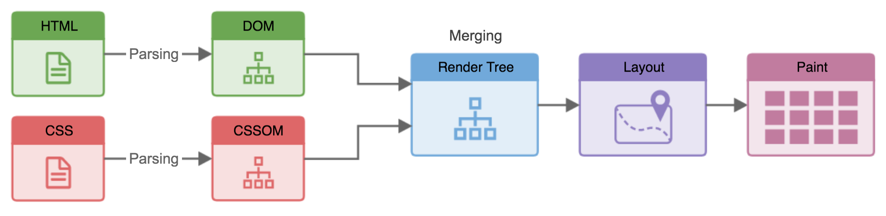

# CTEC3905
##Front-end web development

<div class="flex-center intro">
  
  
  
</div>

## Animation

-----

## Animation

<div class="larger"></div>

There are *three approaches* to animation.

- Use CSS to **transition** a property between values
- Use CSS to add more complex **keyframes** animations
- Use JavaScript **requestAnimationFrame**

Many properties are [animatable](https://www.w3schools.com/CSSref/css_animatable.asp).

-----

## Simple transitions 1
<div class="larger"></div>

We have used transitions on hover before

```css
div {
  background-color: #eee;
  transition: background-color 0.4s;
}
div:hover {
  background-color: black;
}
```

<div class="animation-examples">
	<div class="animation-example-1">Transition <code>background-color</code></div>
</div>

-----

## Simple transitions 2
<div class="larger"></div>

We can use other [pseudo-classes](https://developer.mozilla.org/en-US/docs/Web/CSS/Pseudo-classes) too.

```css
input {
	font-size: 1em;
	transition: 0.4s;
}
input:focus {
	filter: drop-shadow(0 0 0.5em black);
	transform: scale(1.2);
}

```

<div class="animation-examples">
	<label for="focus">Transition on <a href="https://developer.mozilla.org/en-US/docs/Web/CSS/:focus">focus</a></label><input id="focus" class="animation-example-focus">
</div>

-----

## Simple transitions 3

...and we can transition on class toggling.

```js
clickable.addEventListener('click', ev => {
  clickable.classList.toggle("clicked");
});

```

Clicking the container will toggle a class.

```css
#clickable div {
  transform: translateX(100vw);
  transition: transform 0.4s;
}
#clickable.clicked div {
  transform: none;
}
```

<div class="animation-examples" id="clickable">
  Click me
  <div>Click to dismiss</div>
</div>

-----

## Keyframe animations

For more complex animations we can add keyframes.

```css
.animation-example {
	animation: animation1 1s infinite alternate ease-in-out;
}
@keyframes animation1 {
	0% {
		transform: translateX(-100px) rotateZ(20deg);
	}
	100% {
		transform: translateX(100px) rotateZ(-20deg);
	}
}
```

<div class="animation-examples">
	<div class="animation-example-2">Animate <code>transform</code></div>
</div>

-----

## But...

Some properties are MUCH more computationally expensive than others.
So they impact on user experience more.

<figure>
	
</figure>

There is also a final step where the browser draws the pre-painted layers to the screen. This "composite layers" step is extremely cheap.

We want to avoid recalculating the layout (reflow) and **only** trigger repainting.
-----

## Safe properties

<div class="larger"></div>

Avoid changing the size of an element within the flow.

Using these properties will always be OK.

- `opacity` (0..1)
- `transform` (scale, translate, rotate etc)

If you must, then use`filter`, `color` and `background-color` sparingly.

-----

## Animating with Javascript

```js


// Call the step function whenever the browser is ready
let previous;
function step(timestamp) {
  if (previous === undefined) {previous = timestamp};
  const elapsed = timestamp - previous;
  update(elapsed); // This function should update your page somehow
  previous = timestamp;
  window.requestAnimationFrame(step);
}

// This starts the process
window.requestAnimationFrame(step);
```

-----

## Scalable Vector Graphics

[SVGs](https://www.youtube.com/watch?v=4laPOtTRteI)
 define images using maths.
Basically drawing paths between coordinates.
They are lightweight and can be inserted inline into the HTML DOM.


<div class="smaller"></div>

```svg
<svg xmlns="http://www.w3.org/2000/svg" viewBox="0 0 164.546 164.545" width="50px" height="50px">
  <path fill="#2e2d2e" d="M164.546 82.13c.08 45.437-36.69 82.337-82.124 82.415C36.98 164.625.08 127.855 0 82.42-.08 36.977 36.69.081 82.132 0c45.435-.08 82.334 36.69 82.414 82.13"/>
  <path fill="#fff" d="M13.771 75.132s-4.717 9.432-6.93 21.781c-1.174 6.24-.854 8.658 3.97 15.518 9.23 13.122 12.652 16.7 15.808 16.165 3.154-.537 18.006-3.755 22.344-4.819 3.286-.8 3.284-1.594 4.59-7.306 1.306-5.71 3.394-13.676 3.913-18.058.52-4.379-.14-4.246-3.96-9.018-3.823-4.77-12.916-16.963-14.76-19.216-1.847-2.255-2.767-1.59-7.103-.918-4.339.67-10.91 2.408-14.064 3.21-3.153.8-3.152 1.598-3.808 2.66m6.331-44.639S16.07 35.898 12.42 42.24c-2.022 3.688-1.403 9.012-.168 19.252 1.235 10.237 2.25 10.235 6.102 9.41 3.856-.828 14.606-3.098 17.445-3.717 2.838-.62 5.065-5.54 7.693-9.844 2.63-4.308 13.14-17.892 15.258-20.043 2.006-1.79 1.413-3.58.814-8.345-.602-4.77-2.035-14.66-3.335-15.015-1.298-.354-11.339-.349-15.117-.578-3.78-.234-13.348 7.494-21.01 17.133m38.614 68.35s-3.953 15.955-5.272 22.12c-.655 3.618-.786 4.422 6.655 9.367 7.443 4.943 11.164 7.884 13.557 9.22 2.391 1.336 4.514 1.335 11.42-.288 6.896-1.62 13.735-3.077 16.583-4.317 2.786-1.208 7.15-10.865 9.13-17.299 1.978-6.436 3.561-11.665.771-13.938-2.792-2.274-6.118-5.75-10.638-8.823-4.517-3.077-8.372-7.087-10.097-6.283-1.724.811-19.55 5.284-26.447 7.133-3.274.926-5.42 1.723-5.662 3.107m13.96 63.155s3.25-13.624 3.767-16.93c.52-3.306 1.697-3.44 6.411-4.242 4.716-.802 17.281-4.527 19.506-5.323 2.228-.797 3.558-1.208 7.361 1.694 3.805 2.902 12.306 9.244 15.192 11.224 2.097 1.448-7.615 8.482-20.28 11.934-14.666 3.99-32.086 3.888-31.958 1.643M61.36 33.71s-1.749-9.86-2.39-15.265c-.64-5.41-.008-4.773 7.08-7.809 7.086-3.035 23.942-6.883 27.568-7.205 3.623-.326 7.88.781 17.03 5.377 9.147 4.6 11.516 6.184 11.994 8.888.478 2.704 1.601 15.11 1.77 20.837-.152 3.977-1.518 3.51-8.256 6.286-6.908 2.848-13.5 5.62-15.118 6.554-2.19.936-5.884-1.257-11.959-5.193-5.393-3.492-16.473-8.276-21.21-9.666-4.736-1.393-5.96-.487-6.509-2.804m38.28 22.112s-3.38 15.395-4.988 23.26c-1.61 7.534-1.12 8.678 3.427 12.11 4.547 3.428 9.748 8.33 12.508 10.454 2.763 2.127 4.555 4.591 13.307 2.107 11.024-3.132 13.944-3.955 17.346-5.108 3.406-1.152 4.052-2.462 5.338-8.686 1.288-6.225 2.245-15.559 2.885-20.638.641-5.075-.336-5.892-4.399-9.98-4.06-4.084-11.696-10.62-14.623-13.56-2.924-2.944-5.032-3.266-8.6-1.952-3.565 1.316-13.29 4.936-16.858 6.907-3.565 1.97-4.86 2.137-5.343 5.085m59.163 5.846s-5.295 1.753-6.916 2.521c-1.62.767-1.397 6.005-2.036 11.355-.637 5.35-2.567 15.614-3.856 20.202-.752 2.183 2.265 4.006 4.77 8.068 3.906 6.324 5.966 9.82 6.83 8.614.863-1.2 6.463-13.547 6.213-33.96-.666-9.169-2.304-18.334-5.005-16.8"/>
  <path fill="#fff" d="M4.434 106.948s.774-2.245 1.454-1.076c.678 1.172 8.435 13.944 14.735 20.768 2.228 2.145 2.81 2.727 3.11 6.732.293 4.001-.187 4.977-2.512 2.64-2.327-2.337-13.568-16.475-16.786-29.064M99.051 1.862s-1.163-.39-1.645.1c-.48.49 2.228 1.265 6.97 3.306 4.741 2.04 12.1 5.74 15.197 7.88 2.13 1.265 3 1.556 4.838.772 1.838-.783 2.416-1.077.287-2.245-2.132-1.166-15.687-8.368-25.647-9.814m-21.425 145.55c-.418-.02-.838-.043-1.254-.068.644-3.064 1.577-5.155 3.818-5.442 6.58-1.47 16.832-4 16.832-4-11.932 4.883-17.28 3.914-18.594 7.245a47.162 47.162 0 00-.802 2.264M42.637 14.968a73.09 73.09 0 011.692-.94 63.396 63.396 0 011.75-.024c4.747 0 9.461.461 9.461.461s-7.789.256-12.903.503m33.135-6.513s14.5-4.208 19.02-4.408c4.52-.196 13.574 3.59 23.567 9.276C107.236 8.4 98.937 5.181 95.547 5.188c-3.39.004-19.775 3.267-19.775 3.267M21.48 72.825s12.97-3.299 14.92-2.974c1.946.324 17.232 21.253 17.232 21.253s-13.33-16.35-17.228-18.307c-3.898-1.958-14.924.027-14.924.027"/>
  <g clip-path="url(#a)" transform="matrix(.13333 0 0 -.13333 -2.526 164.545)">
    <path fill="url(#b)" d="M1035.01 849.961s66.39-62.152 85.85-81.742c19.45-19.571 18.32-20.731 1.43-163.778 7.84 91.129 12.32 129.2-4.86 152.239-17.16 23.039-82.42 93.281-82.42 93.281"/>
  </g>
  <path fill="#fff" d="M36.71 125.971c10.947-3.316 13.637-3.706 14.593-6.619.955-2.912 4.202-13.003 4.202-13.003s-2.096 9.508-3.24 13.777c-1.146 4.27-5.184 3.693-15.556 5.845m18.961-12.983s2.257-9.34 3.06-13.104c1.13-3.605 8.265-4.11 15.724-6.086 0 0-6.97 2.302-11.51 4.114-4.54 1.808-4.53 7.867-7.274 15.076m4.335 16.58s8.18 5.82 11.772 8.227c3.595 2.406 5.587 2.606 14.95.577 9.37-2.028 11.958-3.038 11.958-3.038s-13.153 2.84-19.927 3.051c-6.779.212-18.753-8.818-18.753-8.818M95.082 81.54s3.693-20.219 4.863-24.977c1.17-4.758 9.606-7.35 18.437-10.93 0 0-10.004 5.171-13.926 7.752-3.924 2.583-3.524 5.554-9.374 28.155m12.087 43.433c2.545-9.542 6.052-17.628 2.525-20.854-3.53-3.227-6.418-6.297-6.418-6.297s5.935 4.84 7.86 6.618c1.924 1.77 1.932 6.3-3.967 20.533"/>
  <path fill="#d1d2d1" d="M82.275 164.545h-.005.005m0 0h.147c45.39-.078 82.13-36.906 82.124-82.284.007 45.378-36.735 82.206-82.124 82.284h-.148M82.131 0h.147-.147m.151 0h-.004.004"/>
  <path fill="#262526" d="M82.275 164.545h-.005C36.901 164.54.08 127.803 0 82.42v-.132C-.008 36.905 36.735.08 82.132 0h.151c14.825 0 28.735 3.924 40.75 10.79-4.427-2.3-15.506-7.698-23.982-8.929 0 0-.438-.146-.888-.146-.283 0-.57.057-.757.246-.48.491 2.228 1.266 6.97 3.307 4.741 2.04 12.1 5.74 15.197 7.88 1.34.796 2.181 1.207 3.08 1.207.528 0 1.076-.143 1.76-.435 1.295-.552 1.965-.86 1.498-1.407 23.16 14.52 38.583 40.26 38.635 69.616v.132c.007 45.378-36.735 82.206-82.124 82.284h-.148m-6.26-17.225c-1.038 5.028-3.34 14.676-3.34 14.676-.056.981 3.24 1.552 8.19 1.552 6.38 0 15.51-.95 23.767-3.195 12.666-3.452 22.378-10.486 20.281-11.934-2.045-1.403-6.912-4.998-10.927-8.006 16.465-7.57 29.577-20.682 36.66-36.787l.117.187c3.394 5.492 5.394 8.85 6.426 8.85.157 0 .292-.078.405-.236.863-1.2 6.463-13.547 6.213-33.96-.617-8.486-2.065-16.97-4.42-16.97-.189 0-.384.055-.585.17 0 0-1.82.604-3.656 1.257-3.85-19.587-16.105-36.345-33.074-46.776-1.155-1.927-4.14-3.679-11.425-7.34-8.183-4.11-12.453-5.43-15.855-5.43-.402 0-.793.018-1.175.053-1.272.113-4.17.66-7.703 1.453a80.274 80.274 0 00-4.547-.13h-.14c-13.019.025-25.256 3.194-35.918 8.753-1.663-.04-3.164-.086-4.197-.148a3.611 3.611 0 00-.172-.004c-3.89 0-13.29 7.64-20.838 17.137 0 0-4.032 5.406-7.682 11.747-1.152 2.101-1.447 4.734-1.259 8.505A68.114 68.114 0 006.27 76.26a68.25 68.25 0 001.736 15.212 83.773 83.773 0 00-1.167 5.442c-1.173 6.24-.853 8.658 3.97 15.518 8.652 12.302 12.203 16.215 15.212 16.215.201 0 .4-.017.597-.05.634-.108 1.74-.324 3.138-.61C42.003 139 58.146 146.132 76.014 147.32M5.462 105.534c-.54 0-1.027 1.414-1.027 1.414 3.218 12.59 14.46 26.727 16.786 29.064.833.837 1.43 1.25 1.838 1.25.732 0 .862-1.322.673-3.89-.299-4.005-.88-4.587-3.109-6.732-6.3-6.824-14.057-19.596-14.735-20.768-.14-.24-.285-.338-.426-.338"/>
  <path fill="#d1d2d1" d="M26.022 128.646c-3.01 0-6.56-3.913-15.212-16.215-4.823-6.86-5.143-9.279-3.97-15.518.34-1.89.736-3.712 1.167-5.442 3.275 14.227 11.014 26.86 21.75 36.516-1.398.285-2.504.501-3.138.61-.198.032-.396.05-.597.05m-14.86-77.903c-.189-3.77.106-6.404 1.258-8.505 3.65-6.34 7.682-11.747 7.682-11.747 7.55-9.497 16.947-17.137 20.838-17.137.06 0 .116.001.172.004 1.033.062 2.534.108 4.197.148-.328.17-.655.344-.98.52-2.92.08-5.628.382-6.988 1.133-3.807 2.11-13.15 11.923-13.15 11.923s11.747-11.736 16.502-12.012a226.25 226.25 0 011.944-.103c-14.286 8.19-25.466 20.772-31.476 35.776m69.703 112.804c-4.95 0-8.245-.57-8.189-1.552 0 0 2.302-9.648 3.34-14.676l.357.023c-.599 2.852-.945 6.55-1.858 10.42 0 0 1.758-6.27 3.112-10.353 1.23.058 2.463.086 3.708.086h.142c11.651-.02 22.678-2.563 32.51-7.083 4.015 3.008 8.882 6.603 10.927 8.006 2.097 1.448-7.615 8.482-20.28 11.934-8.258 2.245-17.389 3.195-23.768 3.195m41.207-147.4c-8.819-5.42-18.906-9.132-29.747-10.637 1.42-.199 2.565-.323 3.222-.323h.01c3.396 0 11.69 3.217 22.802 8.135C108.614 7.78 99.763 4.04 95.14 4.04c-.118 0-.234.001-.346.007-1.36.06-3.618.481-6.114 1.042a78.574 78.574 0 00-2.765-.205c3.533-.793 6.431-1.34 7.703-1.453a12.98 12.98 0 011.175-.052c3.402 0 7.672 1.318 15.855 5.43 7.284 3.66 10.27 5.412 11.425 7.34m35.117 96.513c-1.032 0-3.032-3.357-6.426-8.849l-.117-.187a68.133 68.133 0 005.78-27.63 68.32 68.32 0 00-1.28-13.072c1.835-.653 3.656-1.257 3.656-1.257.201-.115.396-.17.585-.17 2.355 0 3.803 8.484 4.42 16.97.25 20.413-5.35 32.76-6.213 33.96-.113.158-.248.236-.405.236"/>
  <path fill="#d1d2d1" d="M23.06 137.262c-.409 0-1.006-.413-1.839-1.25-2.327-2.337-13.568-16.475-16.786-29.064 0 0 .487-1.414 1.027-1.414.14 0 .285.097.426.338.678 1.172 8.435 13.944 14.735 20.768 2.228 2.145 2.81 2.727 3.11 6.732.188 2.568.058 3.89-.674 3.89m.28-1.542c-.01-6.044-.602-6.553-3.474-9.53-3.297-3.653-8.032-10.11-8.032-10.11s6.841 9.913 8.702 11.865c1.856 1.953 2.373 3.86 2.804 7.775m99.313-121.365c-.898 0-1.739-.41-3.08-1.207-3.097-2.14-10.455-5.84-15.195-7.88-4.743-2.04-7.45-2.816-6.97-3.307.185-.189.473-.246.756-.246.45 0 .888.146.888.146 8.476 1.231 19.555 6.63 23.982 8.93.973.554 1.93 1.13 2.878 1.722.467.546-.203.855-1.5 1.407-.682.292-1.23.435-1.76.435M74.514 157.762c.913-3.87 1.26-7.567 1.858-10.42.416.026.836.05 1.254.068-1.354 4.083-3.112 10.353-3.112 10.353M24.19 27.083s9.344-9.814 13.151-11.923c1.36-.75 4.068-1.053 6.988-1.133a73.09 73.09 0 00-1.692.941c-.71.035-1.366.07-1.944.103-4.755.276-16.503 12.012-16.503 12.012m94.17-13.76c-11.113-4.918-19.407-8.135-22.803-8.135h-.01c-.657 0-1.802.124-3.222.323a77.813 77.813 0 00-3.646-.422c2.496-.56 4.755-.982 6.114-1.042.112-.006.228-.007.345-.007 4.625 0 13.476 3.74 23.221 9.283"/>
  <path fill="#d1d2d1" d="M23.34 135.72c-.432-3.916-.949-5.822-2.805-7.775-1.86-1.952-8.702-11.866-8.702-11.866s4.735 6.458 8.032 10.112c2.872 2.976 3.464 3.485 3.474 9.53"/>
  <path fill="#65696d" d="M61.617 54.66c-1.779 0-3.41-.64-4.507-1.936-2.294-2.71-1.378-7.257 2.044-10.156 1.787-1.513 3.905-2.277 5.847-2.277 1.778 0 3.41.64 4.505 1.936 2.296 2.71 1.38 7.257-2.042 10.156-1.787 1.513-3.905 2.277-5.847 2.277m-10.485 7.836c-.788 0-1.512-.284-1.998-.86-1.017-1.2-.61-3.215.906-4.497.791-.67 1.73-1.01 2.59-1.01.787 0 1.51.284 1.996.858 1.016 1.202.612 3.216-.905 4.498-.79.672-1.729 1.01-2.59 1.01"/>
</svg>

```
-----

## References

<div class="larger"></div>

Study the [example code](https://ctec3905-2020-21.github.io/animations/) and try it out in your assignment.

Some links to further reading.

- [Animation (Chris Coyier)](https://css-tricks.com/almanac/properties/a/animation/)
- [High performance animations (Paul Lewis and Paul Irish)](https://www.html5rocks.com/en/tutorials/speed/high-performance-animations/)
- [Silky CSS: Minimizing Repaints & Jank](https://trendyminds.com/blog/silky-css-minimizing-repaints-jank)
- [SVG can do that?! (Sarah Drasner)](https://www.youtube.com/watch?v=4laPOtTRteI)
- [MDN requestAnimationFrame](https://developer.mozilla.org/en-US/docs/Web/API/window/requestAnimationFrame)
- [D3.js](https://d3js.org/)

-----

<div class="center hero">
  <h2>Animation</h2>

  <div class="flex-center intro">
    
    
    
  </div>

  <p>Share your questions in lab sessions.</p>
  <h3>Dr Graeme Stuart</h3>
  <h4>gstuart@dmu.ac.uk</h4>
</div>
