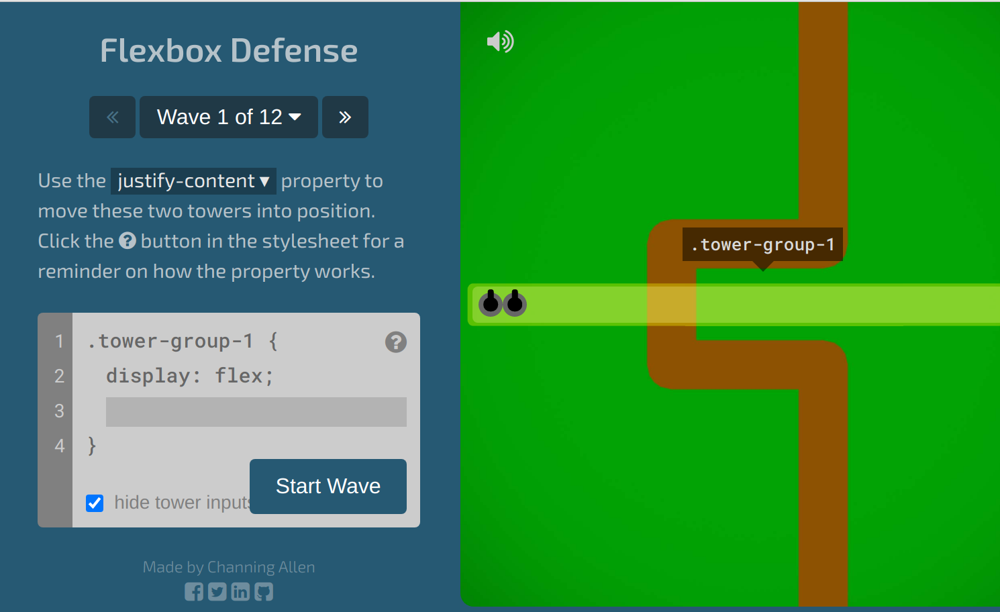

# CTEC3905
## Front-end web development

<div class="flex-center intro">
	
	
	
</div>

### Introduction to CSS
#### Cascading Style Sheets
<p class="flex-center">
	Dr Graeme Stuart
</p>

<span class="reference">
	adapted from <a href="???">MDN</a>
</span>
-----

## CSS handles presentation

<div class="flex j-center a-start">
	
	<ul class="expendable">
		<li>colour</li>
		<li>font</li>
		<li>borders</li>
		<li>padding</li>
		<li>margin</li>
		<li>size</li>
		<li>layout</li>
		<li>position</li>
		<li>transitions</li>
		<li>animations</li>
	</ul>
</div>

Stylesheets give you the ability to choose where elements are placed within your page and how those elements appear.

-----

## Linking stylesheets

A single stylesheet can be used across multiple pages.

```html
<!DOCTYPE html>
<html lang="en">
	<head>
		<meta charset="utf-8">
		<title>My page</title>
		<!-- All styling information is in the linked file -->
		<!-- So swapping out a stylesheet is easy -->
		<link rel="stylesheet" href="css/styles.css">
	</head>
	<body>
		<!-- semantically marked up content goes here -->
		<!-- keep style information out of the content -->
	</body>
</html>
```

Spend some time in the [CSS Zen Garden](http://www.csszengarden.com/) for inspiration.

-----

## CSS syntax

A CSS *ruleset* consists of a [group of] *selector*[s]
and a *declaration block* (between curly brackets) containing one or more *declarations*.

```css
/* comment format */
selector {
	property: value1;
	another-property: value2;
}
```
<figure><figcaption>Generic CSS syntax</figcaption></figure>

One-line formatting is also common, with property/value pairs importantly separated by semi-colons.
This should **only be used when there is only one declaration**.

```css
selector { property: value1; another-property: value2; }
```
<figure><figcaption>One-line formatting with multiple declarations is hard to read</figcaption></figure>

-----

## Some examples

CSS declarations are a way to set CSS properties of elements to given values.
The **selector** determines which elements are targetted by the ruleset.

```css
/* remove default margin from the body element */
body {
	margin: 0;
}

/* style all paragraphs with green text */
p {
	color: green;
}

/* add underline to all links and make them blue */
a {
	text-decoration: underline;
	color: blue;
}
```

-----

## Some more examples

CSS declarations can have multiple values.
This will depend on the property being set.
Multiple values are typically separated by spaces but some properties require comma-separated values.

```css
body {
	margin: 0 auto;
	font-family: Tahoma, Helvetica, sans-serif;
}

p {
	border: 3px solid blue;
}

div.fancy {
	background-image: url(../images/fancy-image.png);
}

```


-----


## Box model

The box model applies to all elements but applies differently to *inline* and *block* level elements. Its easier to consider the way it applies to *block* level elements.

<div id="box">
<div class="margin">margin
	<div class="border">border
		<div class="padding">padding
			<div class="content">content</div>
		</div>
	</div>
</div>
<div class="margin">margin
	<div class="border">border
		<div class="padding">padding
			<div class="content">more content</div>
		</div>
	</div>
</div>
<button id="boxToggle">Toggle view mode</button>
</div>

**Content** is surrounded by **padding** before the box **border**, then elements are separated by **margin**.

Checkout this [interactive demo](http://guyroutledge.github.io/box-model/)
-----
## Box model: padding

```css
div {
	background-color: yellow;
	padding: 2em;
}
```
<div id="padding-demo">padding</div>
<figure><figcaption>padding gives content space within an element</figcaption></figure>
-----

## Box model: border

```css
div {
	background-color: yellow;
	padding: 2em;
	border: 5px dashed red;
}
```
<div id="border-demo">border</div>
<figure><figcaption>borders appear at the edge of the padding</figcaption></figure>

-----

## Box model: border

The **border** property is a shortcut for a collection of properties.

```css

div {
	/* properties can be set individually for fine control */
	border-width: 5px;
	border-style: solid;
	border-color: green;

	/* or just use the shortcut to do the same thing */
	border: 5px solid green;
}
```

-----

## Box model: border-radius


The **border-radius** property adds rounded corners...

```css
div {
	background-color: yellow;
	padding: 2em;
	border: 5px dashed red;
	border-radius: 1em;
}
```
<div id="border-radius-demo">border-radius</div>
<figure><figcaption>rounded corners</figcaption></figure>

-----

## Box model: border-radius

...and can even make an element into a circle

<div id="border-radius-img-demo">
	
</div>
<figure><figcaption>round images!</figcaption></figure>

```css
img {
	height: 200px;
	width: 200px;
	border-radius: 50%;
	border: 4px solid black;
}
```

-----

## Box model: margin

```css
div {
	background-color: yellow;
	padding: 2em;
	border: 5px dashed red;
	border-radius: 3em;
	margin: 2em;
}
```
<div id="margin-demo">margin</div>
<figure><figcaption>margin puts space between elements</figcaption></figure>

-----
## Box model

The **margin**, **padding** and **border-width** properties are very similar.
They can be set to one, two, three or four space-separated values.

```css
div {
	/* one value applies to all sides */
	margin: 1em;

	/* two values applies to top/bottom and left/right */
	padding: 0.5em 1em;

	/* three values applies to top, left/right and bottom */
	border-width: 5px 1px 2px;

	/* four values applies to top, right, bottom, left */
	padding: 0.5em 1em 0 2em;
}

```

Typically, its good practice to only use *pixels*, *ems* or *percentages* for these properties.
-----


## Box model

For **border**, **padding** and **margin**, the four sides can be set individually using `-top`, `-bottom`, `-left` and `-right`.

```css
div {
	margin: 1em;
	padding: 1em;
	border: 1px solid blue;

	/* override the left margin */
	margin-left: 3.5em;

	/* override the top padding */
	padding-top: 0;

	/* change the colour of the top border */
	border-top-color: red;

	/* change the style of the right border */
	border-right-style: dashed;
}

```
-----


## Normal flow: block elements

```css
div {
	font-size: 12pt;
	margin: 15px;
	padding: 15px;
	border: 1px solid red;
	background-color: #ddd;
}
```
<figure><figcaption>style some divs</figcaption></figure>

<figure>
	<div class="flow-example">
		<div>This is a div</div>
		<div>Lorem ipsum dolor sit amet, consectetur adipisicing elit, sed do eiusmod tempor incididunt ut labore et dolore magna aliqua. Ut enim ad minim veniam, quis nostrud exercitation ullamco laboris nisi ut aliquip ex ea commodo consequat.</div>
		<div>Duis aute irure dolor in reprehenderit in voluptate velit esse cillum dolore eu fugiat nulla pariatur. Excepteur sint occaecat cupidatat non proident, sunt in culpa qui officia deserunt mollit anim id est laborum.</div>
	</div>
	<figcaption>Block element flow</figcaption>
</figure>

-----

## Normal flow: inline elements

```css
span {
	font-size: 12pt;
	margin: 15px;
	padding: 15px;
	border: 1px solid red;
}
```
<figure><figcaption>set their background colour</figcaption></figure>

<figure>
	<div class="flow-example">
		<span>This is a span</span>
		<span>Lorem ipsum dolor sit amet, consectetur adipisicing elit, sed do eiusmod tempor incididunt ut labore et dolore magna aliqua. Ut enim ad minim veniam, quis nostrud exercitation ullamco laboris nisi ut aliquip ex ea commodo consequat.</span>
		<span>Duis aute irure dolor in reprehenderit in voluptate velit esse cillum dolore eu fugiat nulla pariatur. Excepteur sint occaecat cupidatat non proident, sunt in culpa qui officia deserunt mollit anim id est laborum.</span>
	</div>
	<figcaption>inline element flow</figcaption>
</figure>

-----

## Normal flow: mixing element types

Mixing block and Inline elements is normal and good but...

```html
<div>A div <span>with a span inside</span> is fine.</div>
<span>A span<div>with a div inside</div> is <em>not OK</em>.</span>
```
<figure><figcaption>Don't put block elements within inline elements</figcaption></figure>

<div class="flow-example">
	<div>
		A div <span>with a span inside</span> is fine.
	</div>
	<span>
		A span<div>with a div inside</div> is <em>not OK</em>.
	</span>
</div>

Its very important to understand which elements are *inline* and which are *block*.
-----

## Block elements

Block elements (such as `<div>`s) will arrange themselves vertically and will take up the full width of their container.

```html
<div></div>
<h1></h1><h2></h2><h3></h3><h4></h4><h5></h5><h6></h6>
<p></p>
<ul></ul>
<ol></ol>
<li></li>
<html></html>
<body></body>
<header></header>
<main></main>
<section></section>
<article></article>
<aside></aside>
<footer></footer>
<nav></nav>
```
<figure><figcaption>Some common block elements (there are many more)</figcaption></figure>

-----

## Inline elements

Inline elements (such as `<span>`s) will arrange themselves like text within a paragraph, wrapping as needed.
Inline elements take the width of their content.

```html
<span></span>

<a></a>
<button></button>
<label></label>
<input>

<small></small>
<em></em>
<strong></strong>
```
<figure><figcaption>Some common inline elements (there are many more)</figcaption></figure>

-----

## What about images?

Images have a default display property of *inline-block*.
This is the same as *block* except they don't force the next element to a new line.
So images can be positioned horizontally.

```html


```
<figure><figcaption>just images</figcaption></figure>

```css
img {
	max-width: 50px;
	max-height: 50px;
	padding: 10px;
	background-color: #bbb;
}
```
<figure><figcaption>give them a width and they line up horizontally, and they obey the box model</figcaption></figure>

<div id="inline-block-demo">
	
	
	
</div>
-----

## Selectors

```css

/* default styles for anchors within paragraphs */
p a { color: skyblue; }

/* fresh/fruity containers have green/pink links */
.fresh a { color: #4b6; }
.fruity a { color: #d6d; }

/* specific links can be snazzy */
a.snazzy {
	background-color: #000;
	border-radius: 1em;
	padding: 0 0.25em;
	text-decoration: none;
}
a.snazzy:hover { background-color: #222; }

```
<figure><figcaption>Decendent combinator and pseudo-classes</figcaption></figure>

See the [w3schools CSS selector reference](https://www.w3schools.com/cssref/css_selectors.asp) and the [MDN pseudo-classes reference](https://developer.mozilla.org/en-US/docs/Web/CSS/Pseudo-classes) for more details.
-----

## Usage

<div class="small"></div>

<div class="selector-example">
	<p>
		With default styles, <a href="#">links are blue</a>.
		<a class="snazzy" href="#">Snazzy links</a> are also blue.
	</p>
	<p class="fresh">
		With fresh styles, <a href="#">links are green</a>.
		<a class="snazzy" href="#">Snazzy links</a> are also green.
	</p>
	<p class="fruity">
		With fruity styles, <a href="#">links are pink</a>.
		<a class="snazzy" href="#">Snazzy links</a> are also pink.
	</p>
</div>
```html
<p>
	With default styles, <a href="#">links are blue</a>.
	<a class="snazzy" href="#">Snazzy links</a> are also blue.
</p>
<p class="fresh">
	With fresh styles, <a href="#">links are green</a>.
	<a class="snazzy" href="#">Snazzy links</a> are also green.
</p>
<p class="fruity">
	With fruity styles, <a href="#">links are pink</a>.
	<a class="snazzy" href="#">Snazzy links</a> are also pink.
</p>
```
-----

## Class and ID selectors

In your CSS file, use `class` selectors for selecting *elements of a particular type*.
Use `id` selectors for selecting a specific *individual element*.

```css
.student {
	width: 5em;
	height: 6.5em;
	border: 5px solid #666;
	background-color: #333;
	color: #eee;
}
#P12345678 {
	border-color: red;
}
```

In your HTML file, add `class` or `id` attributes to make specific elements selectable.

Remember, you cannot use the same ID on more than one element.
Classes can be used to identify elements that should be given similar styles.

-----

## The result

<div class="student-example">

	<figure class="student" id="P12345678">
		
		<figcaption>P12345678</figcaption>
	</figure>

	<figure class="student" id="P12345679">
		
		<figcaption>P12345679</figcaption>
	</figure>

</div>

```html
<figure class="student" id="P12345678">
	
	<figcaption>P12345678</figcaption>
</figure>

<figure class="student" id="P12345679">
	
	<figcaption>P12345679</figcaption>
</figure>
```


-----


## flex-box

The *flexible box* module allows for smooth and responsive control of layout in one dimension.

```html
<div class="flex">
	<div>Element 1</div>
	<div>Element 2</div>
	<div>Element 3</div>
</div>
```
<figure><figcaption>Use flex on a container element</figcaption></figure>

```css
.flex {
	display: flex;
}
```

<figure>
	<div class="flex-demo flex">
		<div>Element 1</div>
		<div>Element 2</div>
		<div>Element 3</div>
	</div>
	<figcaption>Set the display property to flex</figcaption>
</figure>

-----

## flex-box

The `justify-content` property controls how the space is used.
It defaults to `flex-start`;

```css
.flex {
	display: flex;
	justify-content: flex-end;
}
```
<figure>
	<div class="flex-demo flex j-end">
		<div>Element 1</div>
		<div>Element 2</div>
		<div>Element 3</div>
	</div>
	<figcaption>justify-content: flex-end</figcaption>
</figure>

```css
.flex {
	display: flex;
	justify-content: center;
}
```
<figure>
	<div class="flex-demo flex j-center">
		<div>Element 1</div>
		<div>Element 2</div>
		<div>Element 3</div>
	</div>
	<figcaption>justify-content: center</figcaption>
</figure>

-----

## flex-box

The `space-around` and `space-between` options are very powerful.

```css
.flex {
	display: flex;
	justify-content: space-around;
}
```
<div class="flex-demo flex j-around">
	<div>Element 1</div>
	<div>Element 2</div>
	<div>Element 3</div>
</div>
<figure><figcaption>justify-content: space-around</figcaption></figure>

```css
.flex {
	display: flex;
	justify-content: space-between;
}
```
<div class="flex-demo flex j-between">
	<div>Element 1</div>
	<div>Element 2</div>
	<div>Element 3</div>
</div>
<figure><figcaption>justify-content: space-between</figcaption></figure>

-----

## flex-box

The `flex-direction` property can be used to change the direction of the layout.

```css
.flex {
	display: flex;
	flex-direction: column;
	justify-content: space-between;
	height: 10em;
}
```
<div class="flex-demo flex d-column j-between">
	<div>Element 1</div>
	<div>Element 2</div>
	<div>Element 3</div>
</div>
<figure><figcaption>flex-direction: column</figcaption></figure>

-----

## flex-box is important

Try the game [flexbox defense](http://www.flexboxdefense.com/) to learn all the ins and outs of it.

<figure>
	
	<figcaption>https://flexboxdefense.com</figcaption>
</figure>
-----

## Summary

<div class="larger"></div>

- CSS *declarations* are simple property/value pairs, grouped into *rulesets*
- *Rulesets* are applied using *selectors*
- The *display* property determines how HTML elements are laid out
- *Inline* elements flow and wrap like text
- *Block* elements take the full width of their container and force a new line
- *Flex* elements control the layout of their children

-----

## Further information

<div class="larger"></div>


Some additional information and references

- Be inspired in the [CSS Zen Garden](http://www.csszengarden.com/)
- Try this [interactive box model demo](http://guyroutledge.github.io/box-model/)
- Play [flexbox defense](http://www.flexboxdefense.com/) to learn flexbox
- [CSS default values](https://www.w3schools.com/cssref/css_default_values.asp) from w3schools
- [CSS selector reference](https://www.w3schools.com/cssref/css_selectors.asp) from w3schools
- [pseudo-classes reference](https://developer.mozilla.org/en-US/docs/Web/CSS/Pseudo-classes) from MDN

-----

<div class="center hero">
	<h3>Cascading Style Sheets</h3>
	<div class="flex-center intro">
		
		
		
	</div>

	<p>Share your questions in lab sessions.</p>
	<h3>Dr Graeme Stuart</h3>
	<h4>gstuart@dmu.ac.uk</h4>
</div>
