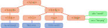

# CTEC3905
##Front-end web development

<div class="flex-center intro">
  
  
  
</div>

## Working with data

-----


## Remember the DOM?

The Document Object Model is a key data structure in the browser.

<figure>
	
	<figcaption>Diagram of the Document Object Model (DOM)</figcaption>
</figure>

We have used code like this to manipulate it.

```js
const element = document.querySelector("p");
element.textContent = "some new text";
```

-----

## The DOM is your document

<figure>
	
	<figcaption>The DOM represented in Chrome developer tools</figcaption>
</figure>

Changing the DOM (or the CSSOM) affects the render tree which changes the page.
We can set [CSS properties](https://developer.mozilla.org/en-US/docs/Web/CSS/CSS_Properties_Reference) directly via JavaScript.

```js
const element = document.querySelector("p");
element.style.setProperty('--custom-variable', "new value");
```
-----

## Creating and editing elements

The [`Document`](https://developer.mozilla.org/en-US/docs/Web/API/Document), [`Node`](https://developer.mozilla.org/en-US/docs/Web/API/Node) and [`Element`](https://developer.mozilla.org/en-US/docs/Web/API/Element) APIs are particularly useful.

```js
// creating
document.createElement(tagName);

// copying
node.cloneNode(true); // pass false for a shallow copy

// editing text content
node.textContent = "new content";

// editing attributes
element.setAttribute(attributeName, value);
element.id = "newId";
element.ariaLabel = "new label";
element.classList.add(className);

// Also event listening
eventTarget.addEventListener(eventType, callback);
```

-----

## Reading and navigating the DOM


```js

// finding elements
document.querySelector(queryString)
document.querySelectorAll(queryString)
element.querySelector(queryString);
element.querySelectorAll(queryString);

// navigating DOM structure
node.previousSibling;
node.nextSibling;
node.parentNode;
node.childNodes;
node.firstChild;
node.lastChild;

// reading data
element.hasAttribute(attributeName);
element.getAttribute(attributeName);
element.id;
element.ariaLabel;
```

-----

## Managing a DOM structure

```js
// create some elements
const header = document.createElement("header");
const main = document.createElement("main");
const section = document.createElement("section");
const h1 = document.createElement("h1");
const p1 = document.createElement("p");
const p2 = document.createElement("p");
const p3 = document.createElement("p");

// compose the DOM structure
header.appendChild(h1);
main.appendChild(section);
section.appendChild(p1);
section.appendChild(p2);
document.body.appendChild(main);
main.insertBefore(header);

// dynamically adjust the structure
section.removeChild(p1);
section.replaceChild(p2, p3);
```

-----

## The storage API

Very useful if you want the browser to remember some data during or between user sessions.

```js
// set the value of a given key
localStorage.setItem(key, value);

// retrieve the value of a given key
const value = localStorage.getItem(key);
```

Local storage can only store strings, so converting data to and from JSON using [`JSON.stringify`](https://developer.mozilla.org/en-US/docs/Web/JavaScript/Reference/Global_Objects/JSON/stringify) and [`JSON.parse`](https://developer.mozilla.org/en-US/docs/Web/JavaScript/Reference/Global_Objects/JSON/parse) is a common approach.

```js
// set the value of a given key
localStorage.setItem(key, JSON.stringify(value));

// retrieve the value of a given key
const value = JSON.parse(localStorage.getItem(key));
```

-----

## JavaScript Object Notation (JSON)

[JSON](https://www.json.org/) is a common data interchange format.
JSON is:

- Lightweight
- Easy for humans to read and write.
- Easy for computers to parse and generate.

JSON is based around **objects** and **arrays**.
These map directly to JavaScript *objects* and *arrays*.
In fact, they map to similar structures in most programming languages.
Values can be strings, numbers, objects, arrays, true, false or null.

```json
{
	"key1": "value",
	"key2": [1.2, 3.4, "value"],
	"key3": [true, false, "value", {"key4": "value"}],
	"key5": ["value", null, "value", {
		"key6": ["value", "value", "value"]
	}]
}

```

-----

## A practical example

Here is a JSON document representing a blog post.

```json

{
	"id": "508252",
	"user" : { "id": "1", "name": "Betty Blogger", "username": "BetB" },
	"title": "Using JSON for blog data",
	"description": "I present a JSON structure for blog posts",
	"content": "OK, so I wanted to get my thoughts out on this...",
	"modified": "2021-03-03T03:03:33Z",
	"published": true,
	"tags": ["blogging", "json", "front-end", "stuff"],
	"comments": [
		{
			"user": {"id": "2", "name": "Brian Blogger", "username": "BriB"},
			"comment": "Great post Betty!",
			"date": "2021-03-04T07:21:18Z"
		}
	]
}

```
-----

<div class="center hero">
  <h2>Working with data</h2>

  <div class="flex-center intro">
    
    
    
  </div>

  <p>Share your questions in lab sessions.</p>
  <h3>Dr Graeme Stuart</h3>
  <h4>gstuart@dmu.ac.uk</h4>
</div>
