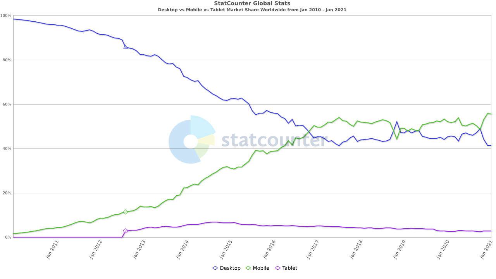
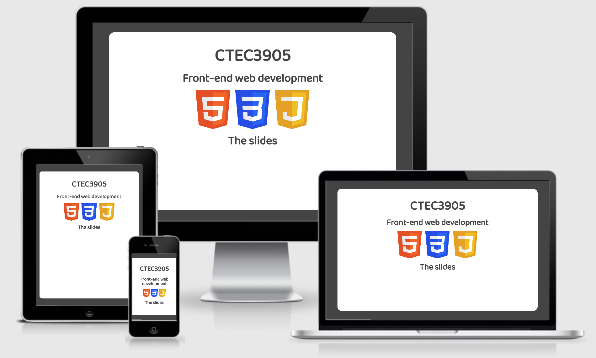
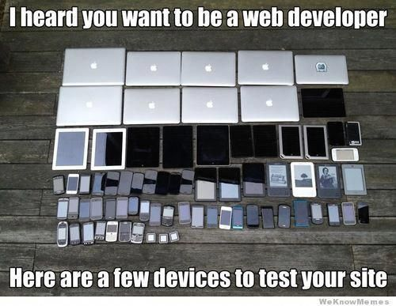

# CTEC3905
##Front-end web development

<div class="flex-center intro">
  
  
  
</div>

## Responsive web design

-----

## Mobile browsers dominate

The most important sizes are mobile and desktop.
Globally, more traffic is now on mobile devices than desktop devices.


<figure>
	
	<figcaption>Mobile devices are increasingly important</figcaption>
</figure>

-----

## CSS media queries

Media queries allow you to restrict specific styles to different **media types**.

```CSS

@media screen {
  /* styles for devices with screens */
}

@media print {
  /* styles for printers - i.e. on paper */
}

@media speech {
  /* styles for text-to-speech screen readers - i.e. audio styles */
}
```

But there's also filters that can be applied based on **media features** such as `aspect-ratio`, `orientation`, `color`, `hover` and (crucially) `width`.


-----

## An example

This example removes background colour and sets all links to show their url when printing a document.

```css
@media print {
	body {
		background-color: #fff;
	}

	.no-print {
		display: none;
	}

	a[href^="http"]::after {
		content: " (" attr(href) ")";
	}
}
```

-----

## More specific filtering

```css
/* default styles always apply */
nav {
  display: flex;
  flex-direction: column;
}

/* applied only when screen orientation is landscape */
@media screen and (orientation: landscape) {
  nav {
    flex-direction: row;
  }
}

/* applied only when hover is supported */
@media (hover: hover) {
  nav a:hover {
    background-color: yellow;
  }
}

```
-----

## A *mobile first* approach

This is a good way to get started and is how we will expect you to structure your media queries for your assignment.

```css
/* default (mobile) styles apply to all screen sizes */
nav {
  display: flex;
  flex-direction: column;
}

/* min-width media query defines styles to apply above a given breakpoint */
@media screen and (min-width: 600px) {
	nav {
		flex-direction: row;
	}
}
@media screen and (min-width: 1200px) {
	nav {
		font-size: 1.2em;
	}
}
```


-----

## Am I responsive?

Go to [http://ami.responsivedesign.is](http://ami.responsivedesign.is/?url=https%3A%2F%2Fctec3905-2020-21.github.io%2Fsplash%2F%3Fslide%3D0#) to see your live sites on various devices.

This is not a site for testing, but it is quite impressive to see the *live* sites displayed as iframes in this way.

<figure>
	
	<figcaption>These slides are responsive (mostly)</figcaption>
</figure>

-----

## Natural breakpoints

<div class="larger"></div>

Make sure your site looks good at **any** viewport width/height by using [natural breakpoints](https://stackoverflow.com/questions/6370690/media-queries-how-to-target-desktop-tablet-and-mobile/20350990#20350990).

<figure>
	
	<figcaption>Don't try to design for individual devices.</figcaption>
</figure>


-----

## Viewport `meta` tag

You will need a `meta` tag in the `head` of your page.
This is **important**.
It will tell mobile browsers that your site is optimised for smaller screens and so prevent the mobile browser from attempting to 'help' you by scaling your site down.

```html
<head>
  <meta charset="utf-8">

  <!-- add one of these to every site -->
  <meta name="viewport" content="width=device-width, initial-scale=1.0">

  <title>Page title</title>
  <link rel="stylesheet" href="styles.css">
</head>
```

-----

<div class="larger"></div>

**References**

- [Responsive Web Design](http://alistapart.com/article/responsive-web-design) (The first, Ethan Marcotte, 2010)
- [HTML Responsive Web Design](https://www.w3schools.com/html/html_responsive.asp) (W3 Schools)
- [Am I Responsive](http://ami.responsivedesign.is/?url=https%3A%2F%2Fswitchoff.nus.org.uk#) (with example site)
- [This Is Responsive](http://bradfrost.github.io/this-is-responsive/) (overload: patterns and resources)

**Books**

- [Luke Wroblewski, ‘Mobile First’](https://abookapart.com/products/mobile-first)
- [Ethan Marcotte, ‘Responsive Web Design’](https://abookapart.com/products/responsive-web-design)

-----

<div class="center hero">
	<h2>Responsive web design</h2>

	<div class="flex-center intro">
		
		
		
	</div>

	<p>Share your questions in lab sessions.</p>
	<h3>Dr Graeme Stuart</h3>
	<h4>gstuart@dmu.ac.uk</h4>
</div>
